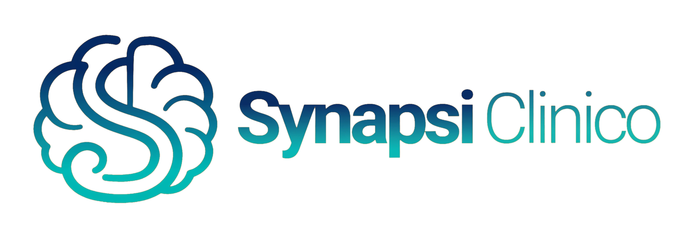
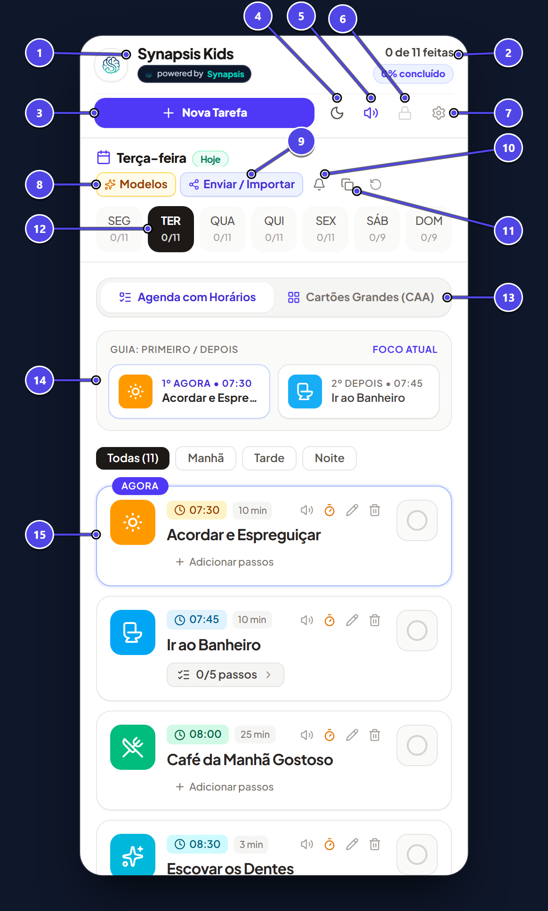
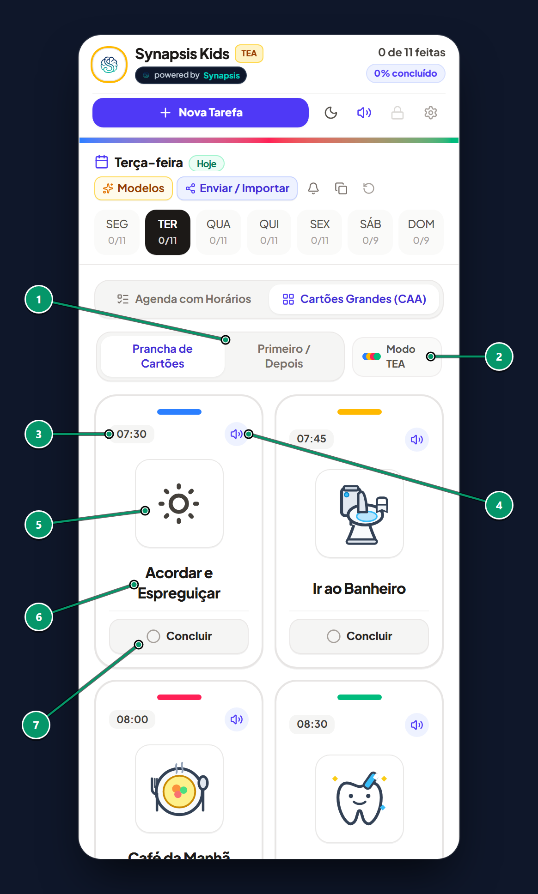
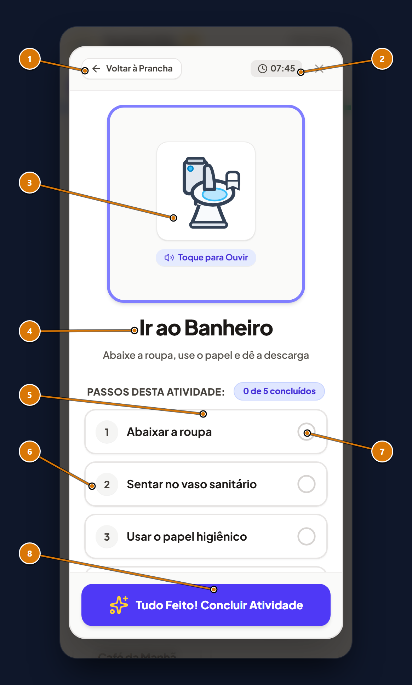
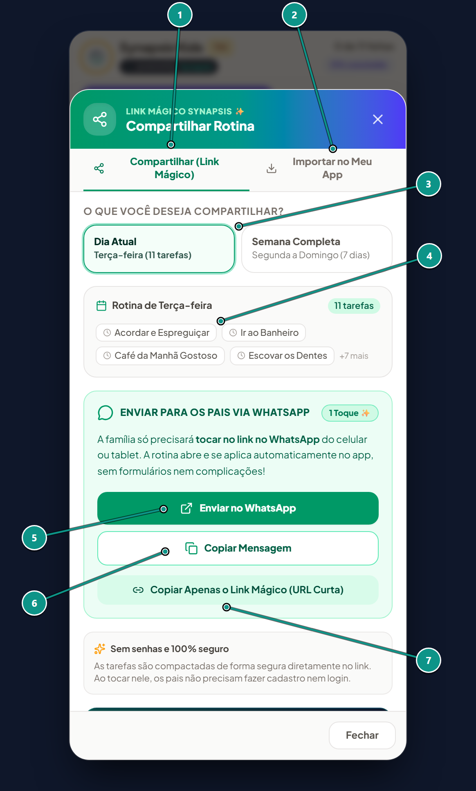
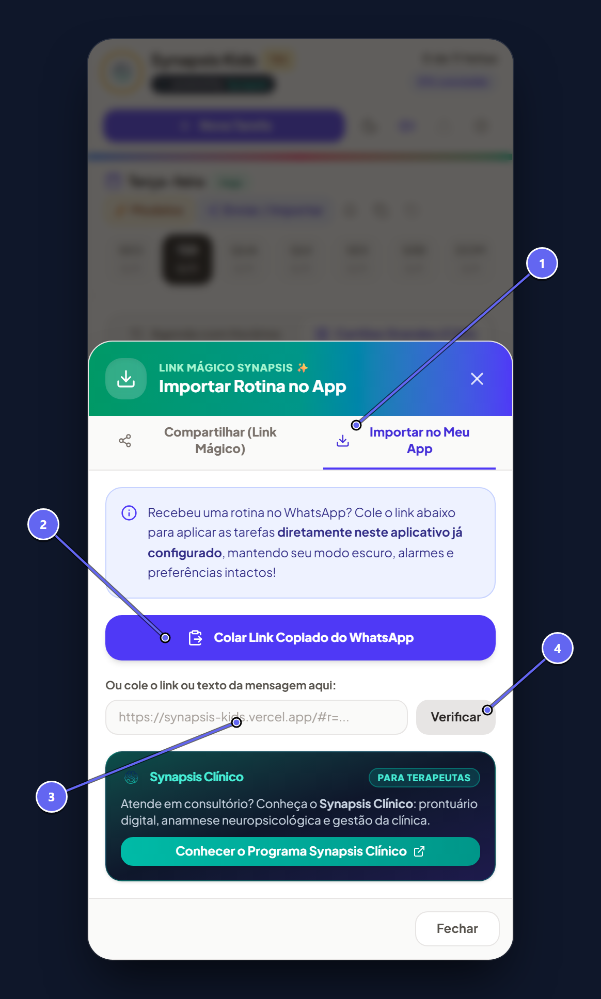
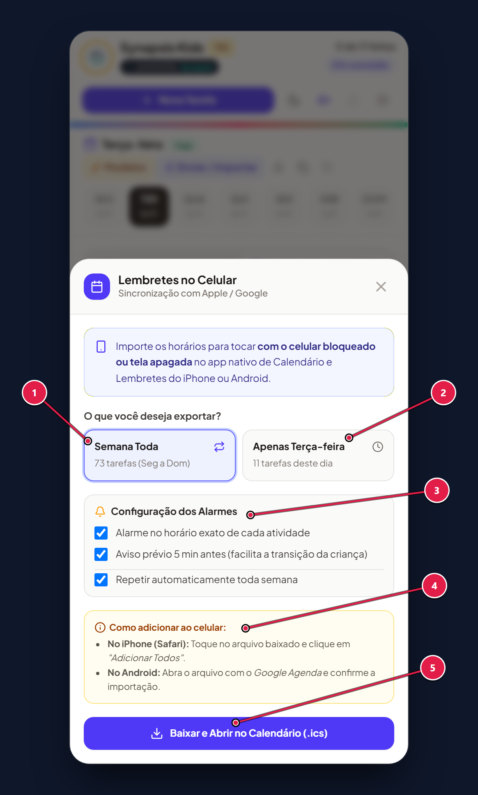
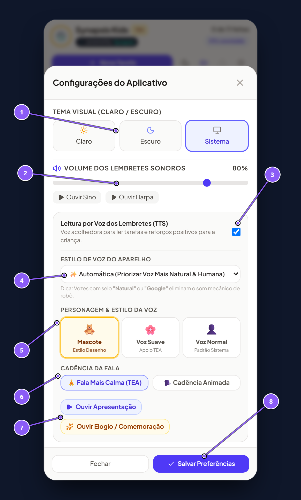

# Manual do Usuário & Guia Clínico de Rotina Visual — Synapsis Kids

  
  &nbsp;&nbsp;&nbsp;&nbsp;&nbsp;&nbsp;&nbsp;&nbsp;
  

  <strong>Ecossistema Synapsis Clínico • Edição Kids</strong> 
  <em>Promovendo Autonomia, Previsibilidade e Regulação Emocional no TEA, TDAH e Neurodesenvolvimento Infantil</em>

---

## 🤝 Nota dos Criadores: Da Clínica para a Vida Real

O **Synapsis Kids** nasceu da união entre a engenharia de software e a sensibilidade do atendimento clínico diário. Na neuropsicologia, sabemos que para uma criança com **Transtorno do Espectro Autista (TEA)**, **TDAH** ou desafios no processamento sensorial, o ambiente cotidiano pode ser ruidoso, imprevisível e fonte de constante sobrecarga cognitiva. Tarefas aparentemente corriqueiras — como a transição de um jogo para o banho, a escovação dos dentes ou o preparo para a escola — frequentemente geram crises de ansiedade quando comunicadas apenas por comandos verbais abstratos.

Este aplicativo foi concebido para atuar como uma **ponte de segurança e previsibilidade**. Ele traduz as diretrizes consagradas da *Análise do Comportamento Aplicada (ABA)*, do método *TEACCH* e dos sistemas de *Comunicação Aumentativa e Alternativa (CAA/PECS)* em uma interface tátil, afetuosa e visualmente serena. Cada detalhe — desde as paletas de cores de baixo estímulo e a sintetização de voz calma, até a decomposição de tarefas complexas em micro-passos sequenciais — foi planejado para substituir o desgaste das ordens repetitivas pelo empoderamento da criança, transformando a rotina do lar e da escola em um ambiente de cooperação, autonomia e afeto.

### 🌿 Concepção Clínica & Curadoria Neuropsicológica
* **Sandra Sorgatti D’Arduini**
* **Psicóloga (CRP 06/162626) • Neuropsicóloga**
* Especialista em Terapia Cognitivo-Comportamental (TCC)
* Especialista em Transtornos do Neurodesenvolvimento
* Especialista em Neuropsicologia e Reabilitação Cognitiva
* **Fundadora e Responsável Técnica — Espaço Integrare (Psicologia e Neuropsicologia)**

### 💻 Arquitetura de Software & Inovação
* **Sergio D’Arduini**
* SD Engenharia • Ecossistema Synapsis Clínico

---

## Sumário
1. [Capítulo 1: Tela Principal & Painel de Controle](#capítulo-1-tela-principal--painel-de-controle)
2. [Capítulo 2: Modo TEA & Prancha Visual PECS](#capítulo-2-modo-tea--prancha-visual-pecs)
3. [Capítulo 3: Foco na Atividade & Checklist de Passos](#capítulo-3-foco-na-atividade--checklist-de-passos)
4. [Capítulo 4: Compartilhamento & Importação por Link Mágico](#capítulo-4-compartilhamento--importação-por-link-mágico)
5. [Capítulo 5: Sincronização de Calendário & Alarmes no Celular](#capítulo-5-sincronização-de-calendário--alarmes-no-celular)
6. [Capítulo 6: Vozes Neurais, Mascote & Regulação Sensorial](#capítulo-6-vozes-neurais-mascote--regulação-sensorial)
7. [Capítulo 7: Instalação como App (PWA) & Melhores Práticas](#capítulo-7-instalação-como-app-pwa--melhores-práticas)

---

## Capítulo 1: Tela Principal & Painel de Controle

A Tela Principal centraliza o planejamento diário da criança, atalhos rápidos e ferramentas de gestão parental e terapêutica. Todo o layout foi projetado para oferecer clareza com zero poluição visual.

> 💡 **Visão da Especialista • Sandra Sorgatti D'Arduini:**  
> *"A previsibilidade temporal reduz em até 80% as crises de transição em crianças com TEA. A presença visual do contador de conquistas e a delimitação do dia da semana constroem a noção de tempo cronológico e promovem o senso de autorregulação."*

### Identificação dos Elementos da Figura 1

| Nº | Elemento / Botão | Descrição e Finalidade | Aplicação Terapêutica / Prática |
|:---:|:---|:---|:---|
| **1** | **Identidade & Logo** | Cabeçalho de identificação com o logotipo do aplicativo. | Toque rápido para recarregar a visualização padrão. |
| **2** | **Contador de Progresso (2/5)** | Mostra a proporção de tarefas concluídas vs pendentes. | Fornece noção concreta de início, meio e fim ("só faltam 3!"). |
| **3** | **Botão + Nova Tarefa** | Abre o formulário de cadastro de nova atividade com ícones e horários. | Permite criar tarefas sob medida para a rotina familiar. |
| **4** | **Tema (Sol/Lua)** | Alternador instantâneo entre Modo Claro e Modo Escuro. | Essencial no período noturno para reduzir estímulos luminosos. |
| **5** | **Controle Geral de Som** | Ativa ou silencia sinos, harpas e falas com 1 toque. | Adequação rápida para consultórios, escolas ou locais silenciosos. |
| **6** | **Bloqueio Parental (PIN)** | Cadeado de proteção com senha de 4 dígitos. | Impede que a criança exclua ou altere tarefas acidentalmente. |
| **7** | **Menu de Configurações** | Ajustes finos de vozes neurais, volume e estilo do mascote. | Personalização auditiva para evitar sobrecarga sensorial. |
| **8** | **Modelos Clínicos Prontos** | Rotinas estruturadas validadas (Matutina, Escolar, Desfralde, Noturna). | Economiza tempo ao carregar rotinas completas com 1 clique. |
| **9** | **Enviar / Importar Rotinas** | Geração e importação de Link Mágico sem necessidade de servidor na nuvem. | Sincronização imediata entre pais, cuidadores, avós e terapeutas. |
| **10** | **Sincronizar Calendário (.ics)** | Exporta alarmes para o Google Agenda, iPhone ou Samsung Calendar. | Faz o celular tocar nos horários das tarefas sem manter o app aberto. |
| **11** | **Copiar Programação** | Duplica as atividades de um dia para outros dias da semana. | Reaproveita a rotina escolar de terça para quarta a sexta-feira. |
| **12** | **Seletor de Dias da Semana** | Navegação entre segunda e domingo com destaque para o dia atual. | Permite antecipar eventos de dias futuros com a criança. |
| **13** | **Alternador de Visualização** | Alterna entre formato Lista e Prancha de Cartões Grandes (Modo TEA). | Adapta a densidade de estímulos ao perfil de cada criança. |
| **14** | **Bloco Primeiro / Depois** | Destaque da tarefa atual ("Agora") associada à próxima ("Depois"). | Técnica padrão de intervenção comportamental para motivar tarefas desafiadoras. |
| **15** | **Cartão de Tarefa Interativo** | Exibe pictograma, horário, botão de áudio e status de conclusão. | Toque no cartão para abrir a tela de micro-passos sequenciais. |

---

## Capítulo 2: Modo TEA & Prancha Visual PECS

A Prancha Visual ativa o modo de máxima acessibilidade cognitiva. Baseada nos princípios do **PECS (Picture Exchange Communication System)** e da **Comunicação Aumentativa e Alternativa (CAA)**, ela elimina textos longos e prioriza cartões amplos de alto contraste e fácil acionamento tátil.

> 💡 **Visão da Especialista • Sandra Sorgatti D'Arduini:**  
> *"Crianças não alfabetizadas ou no início do letramento se orientam principalmente pela pista visual concreta. O pictograma atua diretamente no córtex visual, dispensando o esforço de decodificação de texto e gerando autonomia imediata."*

### Identificação dos Elementos da Figura 2

| Nº | Elemento / Botão | Descrição e Finalidade | Aplicação Terapêutica / Prática |
|:---:|:---|:---|:---|
| **1** | **Seletor de Modo Visual** | Alterna entre Prancha Completa e Modo Foco Único (Primeiro / Depois). | Reduz a sobrecarga em dias de desregulação sensorial. |
| **2** | **Selo Modo TEA Ativo** | Indicador de interface adaptada para baixa frustração. | Garante botões grandes que facilitam o toque motor infantil. |
| **3** | **Horário da Atividade** | Destaque do horário programado em dígitos limpos. | Associa o tempo do relógio com a rotina física da casa. |
| **4** | **Ouvir Instrução por Voz** | Alto-falante que vocaliza a atividade na velocidade escolhida. | Canal duplo (auditivo + visual) que reforça a compreensão. |
| **5** | **Pictograma Visual CAA** | Ilustração de fácil identificação representando concretamente a ação. | Comunicação direta que dispensa necessidade de leitura de texto. |
| **6** | **Título em Fonte Grande** | Tipografia sem serifa, ampliada e de alto contraste. | Estimula o letramento natural associado à imagem. |
| **7** | **Botão Concluir Tarefa** | Botão amplo de marcação na base do cartão. | Dispara confetes coloridos, reforço positivo sonoro e fala motivadora. |

---

## Capítulo 3: Foco na Atividade & Checklist de Passos

Ao tocar em qualquer cartão da prancha, abre-se o **Modal de Foco**. Ele isola a atividade de todas as outras distrações e decompõe comandos complexos em **micro-passos sequenciais**.

> 💡 **Visão da Especialista • Sandra Sorgatti D'Arduini:**  
> *"A Análise de Tarefas (Task Analysis) é uma das ferramentas mais poderosas da terapia ABA. Dizer 'escove os dentes' envolve mais de 8 comandos motores simultâneos. Quebrar em etapas permite que a criança experimente o sucesso a cada pequeno passo cumprido, construindo autoeficácia."*

### Identificação dos Elementos da Figura 3

| Nº | Elemento / Botão | Descrição e Finalidade | Aplicação Terapêutica / Prática |
|:---:|:---|:---|:---|
| **1** | **Botão Voltar à Prancha** | Retorna à tela anterior sem perder os passos já marcados. | Permite rever outras tarefas sem resetar o progresso. |
| **2** | **Horário Programado** | Exibição do horário da atividade no canto superior. | Mantém a orientação temporal constante. |
| **3** | **Desenho Central Interativo** | Ilustração tátil em destaque com efeito sonoro integrado. | A criança pode tocar repetidas vezes no desenho para ouvir a instrução. |
| **4** | **Título da Atividade em Destaque** | Nome da tarefa em fonte gigante e legibilidade total. | Foco absoluto na ação presente, evitando dispersão mental. |
| **5** | **Painel de Micro-Passos** | Seção de checklist contendo as etapas individuais da tarefa. | Garante a correta execução de etapas higiênicas e funcionais. |
| **6** | **Número e Descrição do Passo** | Instrução curta e clara (ex: `1. Levantar a tampa do vaso`). | Sequenciamento motor lógico e sem ambiguidades. |
| **7** | **Checkbox Tátil de Conclusão** | Caixa ampla de marcação com risco suave do texto. | Gera dopamina e sensação de conquista intermediária imediata. |
| **8** | **Botão "Tudo Feito!"** | Finaliza a atividade por completo ao concluir os passos. | Aciona comemoração do mascote com som suave e sem sobreposição de áudio. |

---

## Capítulo 4: Compartilhamento & Importação por Link Mágico

O Synapsis Kids utiliza tecnologia de compressão algorítmica (*LZString*) que condensa toda a programação semanal em um **Link Mágico** para o WhatsApp, sem depender de banco de dados na nuvem ou senhas.

> 💡 **Visão da Especialista • Sandra Sorgatti D'Arduini:**  
> *"A consistência entre o consultório, a casa e a escola é o pilar do sucesso terapêutico. O terapeuta pode montar a rotina no consultório e enviá-la aos pais pelo WhatsApp em 1 clique, garantindo que a mesma linguagem visual seja adotada em todos os ambientes da criança."*

### Identificação dos Elementos da Figura 4

| Nº | Elemento / Botão | Descrição e Finalidade | Aplicação Terapêutica / Prática |
|:---:|:---|:---|:---|
| **1** | **Aba "Compartilhar Rotina"** | Painel ativo de geração de mensagens e links de envio. | Envio rápido para cuidadores e professores. |
| **2** | **Aba "Importar no Meu App"** | Aba receptora para carregar rotinas enviadas por outros celulares. | Use quando receber uma programação enviada por outra pessoa. |
| **3** | **Filtro Dia Atual vs Semana** | Escolha entre exportar apenas o dia aberto ou a grade semanal inteira. | Envie a programação de um dia especial ou a rotina regular completa. |
| **4** | **Resumo Visual das Atividades** | Pré-visualização das tarefas com horários e ícones. | Permite conferir o conteúdo exato antes de disparar a mensagem. |
| **5** | **Botão "Enviar no WhatsApp"** | Abre o WhatsApp com mensagem formatada e o link encurtado. | Facilidade extrema para mães, pais e avós com 1 toque. |
| **6** | **Botão "Copiar Mensagem"** | Copia o texto completo para a área de transferência. | Ideal para enviar por Telegram, E-mail ou salvar no Bloco de Notas. |
| **7** | **Copiar Apenas o Link Mágico** | Copia exclusivamente a URL criptografada. | Perfeito para fixar em murais digitais ou painéis escolares. |

### Identificação dos Elementos da Figura 4b

| Nº | Elemento / Botão | Descrição e Finalidade | Aplicação Terapêutica / Prática |
|:---:|:---|:---|:---|
| **1** | **Aba Ativa "Importar"** | Interface de recebimento seguro de novas rotinas. | Garante que você está no fluxo de carregamento de dados. |
| **2** | **Botão "Colar Link Copiado"** | Detecta e cola automaticamente o link do WhatsApp com 1 toque. | Elimina a complexidade técnica de recortar e colar links longos. |
| **3** | **Campo de Inserção de Link** | Área de texto para digitação ou colagem manual. | Segurança caso o navegador restrinja o acesso automático à área de transferência. |
| **4** | **Botão "Verificar Link"** | Descompacta e exibe a pré-visualização das tarefas recebidas. | Não substitui os dados do seu aparelho sem sua confirmação expressa. |

---

## Capítulo 5: Sincronização de Calendário & Alarmes no Celular

O aplicativo gera um arquivo universal de calendário (`.ics`) compatível com **Google Agenda**, **Apple Calendar (iOS)** e **Samsung Calendar**.

### Identificação dos Elementos da Figura 5

| Nº | Elemento / Botão | Descrição e Finalidade | Aplicação Terapêutica / Prática |
|:---:|:---|:---|:---|
| **1** | **Opção "Semana Toda"** | Exporta todos os eventos de segunda a domingo em um único arquivo. | Ideal para planejar a semana letiva completa de uma vez. |
| **2** | **Opção "Apenas o Dia Selecionado"** | Exporta unicamente as atividades do dia atual (ex: Terça-feira). | Perfeito para dias atípicos, passeios ou consultas médicas. |
| **3** | **Configuração dos Alarmes** | Define a antecedência do aviso (no horário, 5 min ou 15 min antes). | Fornece o tempo prévio fundamental para preparar a criança antes de trocar de atividade. |
| **4** | **Instruções para iPhone e Android** | Guia passo a passo de como abrir o arquivo em cada sistema operacional. | Instruções fáceis para abrir direto no aplicativo nativo de agenda. |
| **5** | **Botão "Baixar e Abrir no Calendário"** | Faz o download do arquivo `.ics` e aciona o calendário do celular. | O celular passa a tocar e notificar os responsáveis automaticamente. |

---

## Capítulo 6: Vozes Neurais, Mascote & Regulação Sensorial

Crianças com sensibilidade auditiva (hiperacusia) frequentemente rejeitam ruídos agudos ou vozes robóticas. O Synapsis Kids inclui opções finas de equalização, cadência calmante e sintetizadores de voz para oferecer acolhimento sem sobrecarga.

> 💡 **Visão da Especialista • Sandra Sorgatti D'Arduini:**  
> *"Muitas crianças no espectro autista apresentam processamento auditivo desacelerado. Reduzir a velocidade da fala para 0.85x e adotar entonações previsíveis e afetuosas permite que a criança decodifique a instrução com tranquilidade, sem entrar em estado de alerta ou defesa sensorial."*

### Identificação dos Elementos da Figura 6

| Nº | Elemento / Botão | Descrição e Finalidade | Aplicação Terapêutica / Prática |
|:---:|:---|:---|:---|
| **1** | **Tema Visual (Claro / Escuro / Sistema)** | Ajuste de contraste e brilho da tela do aplicativo. | Previne fadiga ocular e estresse fotossensível. |
| **2** | **Volume dos Lembretes Sonoros** | Slider de intensidade para os sinos harmônicos e harpas. | Permite regular o som em volume baixo e suave para crianças sensíveis. |
| **3** | **Leitura por Voz dos Lembretes (TTS)** | Chave liga/desliga da narração em voz alta das atividades. | Permite manter apenas avisos musicais sutis se a criança preferir silêncio vocal. |
| **4** | **Seleção do Motor de Voz** | Lista de vozes instaladas no smartphone (Google, Apple, Microsoft). | Escolha a voz mais acolhedora e natural em português brasileiro. |
| **5** | **Estilo do Locutor (Mascote vs Suave TEA)** | Alternador de personalidade: **Mascote Animado** ou **Voz Suave (TEA)**. | O tom *Mascote* gera entusiasmo lúdico, enquanto o *Suave TEA* entrega estabilidade e calma. |
| **6** | **Cadência da Fala (Calma vs Animada)** | Velocidade do sintetizador ajustável entre 0.85x e 1.0x. | A cadência lenta favorece a compreensão auditiva de crianças neurodivergentes. |
| **7** | **Botões de Teste Auditivo** | Ouvir apresentação do mascote e demonstração de elogio antes de salvar. | Valide previamente com a criança se o som agrada antes do uso no dia a dia. |
| **8** | **Botão "Salvar Preferências"** | Grava permanentemente os ajustes na memória do aparelho. | As escolhas persistem para sempre mesmo fechando e reabrindo o navegador. |

---

## Capítulo 7: Instalação como App (PWA) & Melhores Práticas

### Como Instalar na Tela Inicial do Celular
* **No Android (Google Chrome):** Acesse o link no Chrome, toque nos três pontinhos no canto superior direito e selecione `Adicionar à tela inicial` ou `Instalar aplicativo`.
* **No iPhone / iPad (Safari):** Abra o link no Safari, toque no botão de Compartilhar (ícone do quadrado com seta para cima) e selecione `Adicionar à Tela de Início`.

### Diretrizes Práticas para Pais e Terapeutas
1. **Apresentação Prévia:** Converse sobre a rotina no início do dia ou na noite anterior. O cérebro infantil se regula pela antecipação segura.
2. **Consistência e Parceria:** Use o botão de compartilhamento para que os avós, cuidadores e professores da escola mantenham a mesma sequência de atividades.
3. **Reforço Positivo Imediato:** Sempre comemore a marcação dos passos com palavras de incentivo genuínas junto com o elogio do aplicativo.

---

  <strong>Synapsis Kids • Autonomia, Previsibilidade e Amor em Cada Pequena Conquista.</strong> 
  <em>Desenvolvido em parceria científica com o <strong>Espaço Integrare — Psicologia e Neuropsicologia</strong>.</em>

